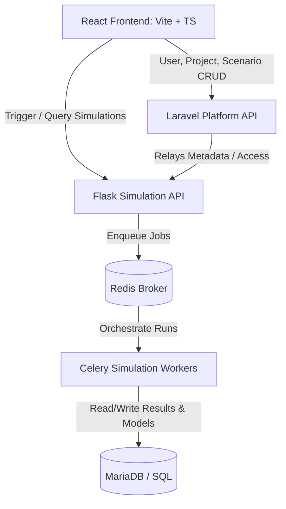

# Loadpath Meridian

Loadpath Meridian is a cloud-based energy infrastructure modeling, simulation, and scenario-planning platform. It allows planning teams to design electric distribution systems, simulate dispatch mixes, run optimal power flow, perform capacity expansion, and evaluate grid reliability.

---

## 🛠️ Technology Stack


---

## 🏗️ Architecture



The application is organized as a production-shaped monorepo:

*   **`apps/web`**: Single-Page App built with React and TypeScript, providing dashboards, report comparisons, operations status, and LLM-assisted recommendations.
*   **`apps/platform`**: Laravel API managing accounts, projects ownership, scenario constraints, and subscriptions.
*   **`apps/simulation`**: Flask API and background Celery workers driving technical simulations using real solvers.
*   **`infra`**: Production and development Docker and service orchestration configurations.
*   **`docs`**: Product notes, architecture design sheets, and operational manuals.

---

## ⚡ Energy Engine Adapters

When simulations are triggered, they compile optimization parameters and run through specialized solver adapters:

1.  **PyPSA** (Python for Power System Analysis): Formulates linear optimal power flow.
2.  **pandapower**: Conducts active power network loading and load-flow analysis.
3.  **NREL PySAM**: Models performance estimations based on imported weather resource datasets.
4.  **pvlib**: Computes clear-sky solar irradiance levels.
5.  **OSeMOSYS**: Optimizes long-term generation capacity expansions via Pyomo and HiGHS solvers.

---

## 🚀 Getting Started

### Prerequisites

Ensure you have Docker and Docker Compose installed.

### Run Locally (Docker)

1.  Clone the repository and navigate to the directory:
    ```bash
    git clone https://github.com/pradhankukiran/loadpath-meridian.git
    cd loadpath-meridian
    ```

2.  Spin up the entire orchestration stack:
    ```bash
    docker compose -f infra/docker-compose.yml up -d
    ```

3.  Apply database migrations for the platform API:
    ```bash
    docker compose -f infra/docker-compose.yml exec platform php artisan migrate --seed
    ```

4.  Open your browser and navigate to:
    - Frontend client: `http://localhost:5173`
    - Platform API: `http://localhost:8080/api/health`
    - Simulation API: `http://localhost:5001/api/health`

